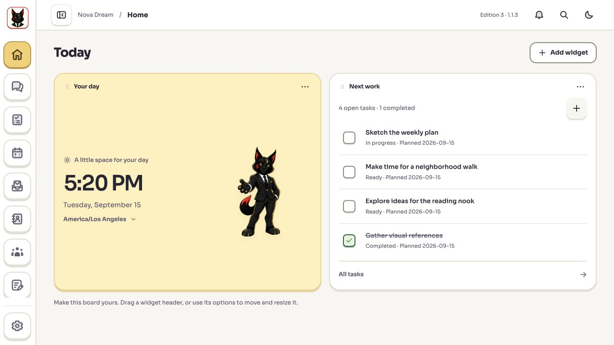
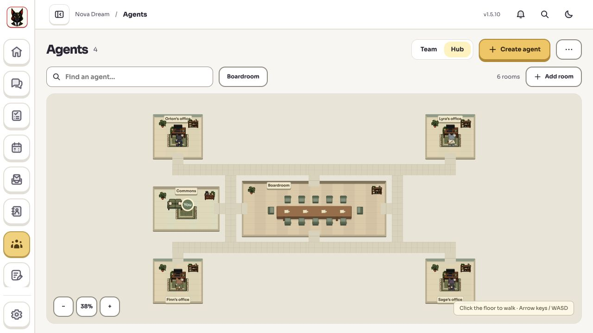
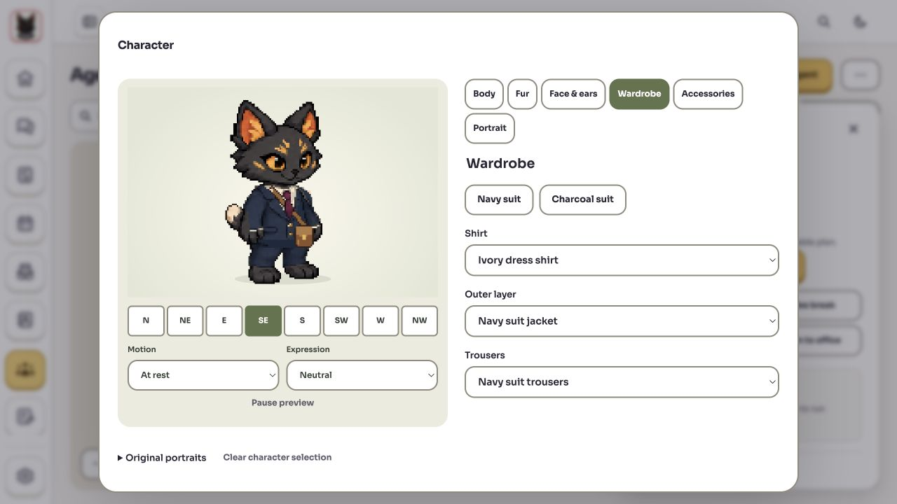
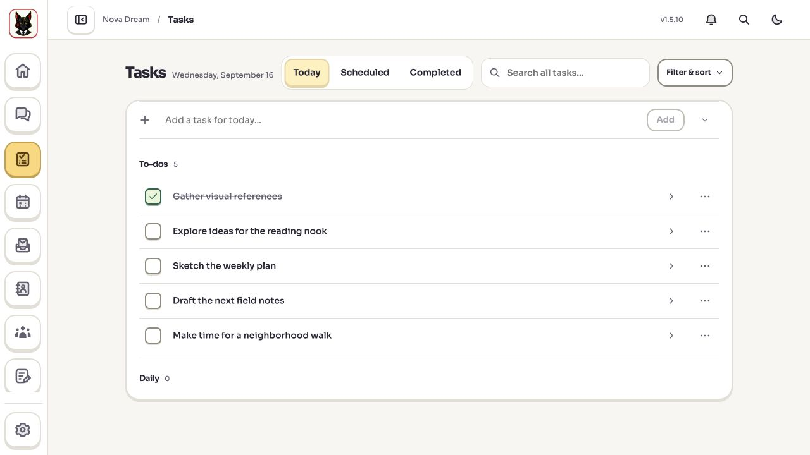
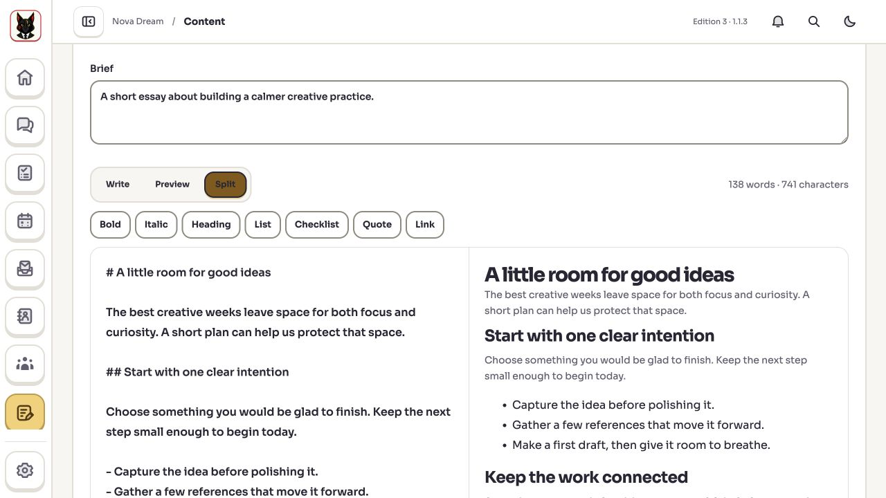
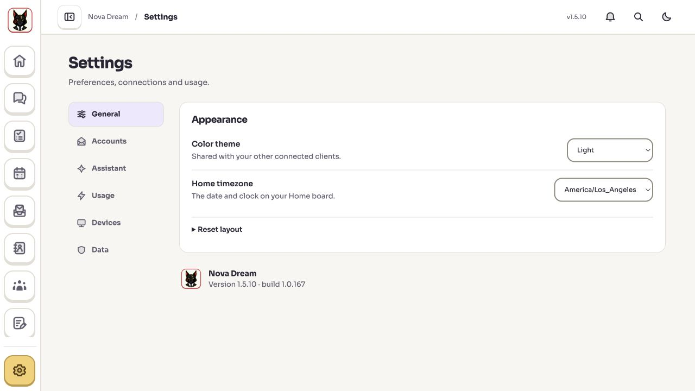

# Nova Dream


The living [design system](docs/DESIGN-SYSTEM.md) records accepted UI principles, current visual tokens and open design decisions.

A self-hosted, single-owner workspace for your Assistant, agents and everyday work.

Nova brings together a customizable Home board, Tasks and Projects, Google/Microsoft Calendar and Inbox, Contacts, a writing workspace, Profile quests and XP, voice conversations, and a modular pixel-art agent office.

[](docs/screenshots/home.jpg)

## A look inside

Actual screenshots from Nova Dream 1.5.10, using fictional demo tasks, writing and agents. New installations start empty; no personal data or connected accounts are shown. Select any image to view it at full size.

<table>
  <tr>
    <td width="50%" valign="top">
      <strong>A home for your agents</strong><br>
      Individual offices, connected paths and a shared boardroom.<br><br>
      <a href="docs/screenshots/agent-hub.jpg"></a>
    </td>
    <td width="50%" valign="top">
      <strong>Characters with their own style</strong><br>
      Choose fur, features, clothing and accessories.<br><br>
      <a href="docs/screenshots/character-creator.jpg"></a>
    </td>
  </tr>
  <tr>
    <td width="50%" valign="top">
      <strong>A clear plan for today</strong><br>
      Capture work, keep track of progress and return to what matters.<br><br>
      <a href="docs/screenshots/tasks.jpg"></a>
    </td>
    <td width="50%" valign="top">
      <strong>Room to write and refine</strong><br>
      Draft in Markdown with a formatted preview alongside it.<br><br>
      <a href="docs/screenshots/content-writing.jpg"></a>
    </td>
  </tr>
</table>

**Compact settings, clear choices.** Accounts, Assistant preferences, provider usage, devices and data each have their own place.

[](docs/screenshots/settings.jpg)

This repository contains the application source and synthetic tests. It starts with an empty workspace. You use your own accounts, credentials and hosting; no maintainer account, production database, conversation history or live deployment is included. A public source repository does not make anyone's private workspace public.

## Choose where Nova runs

**A VPS is optional.** Run Nova on your own computer, or host it on an always-on server. Phone and browser clients connect to whichever host you choose.

Settings → **Usage** shows provider-reported allowances and reset times, with recent runtime token activity. Some providers do not expose these figures.

Settings → **Devices** provides device-specific installation guidance, local draft-storage status and optional desktop links. A linked, awake computer can accept reviewed app-control requests from Nova while ordinary host work continues independently. The current desktop companion build targets Apple Silicon Macs; public notarized installers and Windows/Linux packages are not included. See [desktop setup and private downloads](docs/DESKTOP-COMPANION.md).

## Work from any device

- Choose a GitHub repository and prepare a feature branch on your Nova host.
- Coordinate research, implementation and review with your saved agents.
- Inspect actual changes, commit, push and open a draft pull request.
- Browse public websites in an isolated host browser with text and screenshots.

A VPS remains optional. A local host must stay online; a server can keep working
when your personal computer is off. Git, GitHub CLI and Chrome/Chromium are host
prerequisites for these optional tools. See [setup and workflow details](docs/HOST-WORK.md).

## Quick start

Requires **Node.js 22.19 or newer** and npm. Node 22.23.2 is the reference runtime.

```sh
npm ci
npm run build
npm start
```

Open **http://127.0.0.1:4383/**. Local development uses `npm run dev` and **http://127.0.0.1:4384/**. The backend stays on loopback. Avoid running both production and development on the same service port.

The default workspace is stored in `.data`, outside Git. Back it up before changing builds. The app verifies built client/service hashes before startup. An existing running instance is not automatically upgraded just because a new build exists.

## Connect your services

- **Assistant, agents and voice:** configure your own OpenClaw/ChatGPT connection in Settings. The supported native reference is OpenClaw 2026.9.2. Connected AI subscriptions, API availability and usage limits belong to their providers. Voice needs browser microphone permission and a supported realtime connection.
- **Google and Microsoft:** register your own OAuth application and use the callback shown in Settings. Choose the scopes you need; server hosting requires a Web callback and server-side client credentials. No shared developer credentials are shipped.
- **Agents:** create your own team and explicitly select their workspace access. Native computer control requires a compatible, permissioned local connection; a VPS cannot operate a powered-off personal computer.
- **Remote browser access:** follow [the Linux host recipe](deploy/README.md) and [protected Vercel gateway recipe](deploy/vercel/README.md). Keep authentication in front of the app. This is a single-owner application, not a public multi-tenant service.

## What is included

- Revisioned Tasks, Projects, recurrence, checklists, history, Trash and recovery-aware editing.
- Assistant conversations, files, captured-source reading, outputs, queues, tools and background assignments.
- Voice captions, mute and end, using your configured connection.
- Mail/calendar workflows with explicit confirmations and preserved uncertain outcomes.
- Content drafts, reviews, revisions, collections, templates and exports.
- Shared character appearance, agent offices, collaboration space, quests and progression.
- Encrypted backup creation, review and restoration into a separate paused workspace.

## Backups and privacy

Use **Settings → Data** to create an encrypted export and keep its password outside the host. Backups include their own coverage summary; browser-only unsaved drafts, external Work directories and separately hosted histories may require separate copies. Recovery creates a new copy with connected execution paused for review. Reconnect your accounts through their supported sign-in flows.

Keep data directories, environment files, encryption keys, cloud credentials and downloaded backups out of Git. Automatic independent off-server backup scheduling is not included in this release. See [security reporting and deployment boundaries](SECURITY.md).

## Development and verification

```sh
npm run typecheck
npm test
npm run quality
```

The coherent quality gate includes type checking, tests, production dependency audits, release metadata validation and the client/service build. CI runs the same gate. Internal package identifiers retain the Edition 3 name for compatibility; `private: true` prevents accidental npm package publication. Source distribution is separate from signed desktop installers, which are not provided here.

The accepted pixel character and current runtime assets are included. Unused experimental 3D models, downloaded generation outputs, private design records and authoring environments are excluded. See [third-party notices](THIRD_PARTY_NOTICES.md) and [the changelog](CHANGELOG.md).

## License

MIT; see [LICENSE](LICENSE). Original third-party copyright and license notices are retained. Dependencies keep their respective licenses. Bundled original/generated artwork is provided under the project license to the extent the contributors hold applicable rights; no exclusivity or trademark rights are promised.

## Optional weather widgets

Add a Weather widget and choose a city explicitly. Nova sends that city search and the selected location's coordinates to Open-Meteo; it does not request device geolocation. Forecasts are fetched by the host and cached for 15 minutes across matching widgets. A failed refresh keeps the last available forecast visibly marked stale; an unavailable forecast is never replaced with example data.

The default Open-Meteo endpoint is for personal and other non-commercial use within its published limits. A public source repository does not itself grant commercial API access. For commercial deployments, obtain an appropriate [Open-Meteo subscription](https://open-meteo.com/en/pricing), set `OPEN_METEO_API_KEY` in the host service environment, and restart the service. Nova then uses the customer forecast and geocoding endpoints. Keep this key out of client configuration, widget settings, and source control. See the current [service terms](https://open-meteo.com/en/terms) before deployment.

Weather data uses [CC BY 4.0](https://creativecommons.org/licenses/by/4.0/). Preserve the adjacent Open-Meteo attribution and licence links in weather widgets, and identify modifications when applicable. City-search data is credited to GeoNames. These data licences are distinct from access to the hosted API; see [Open-Meteo's attribution requirements](https://open-meteo.com/en/licence) and [geocoding documentation](https://open-meteo.com/en/docs/geocoding-api).
